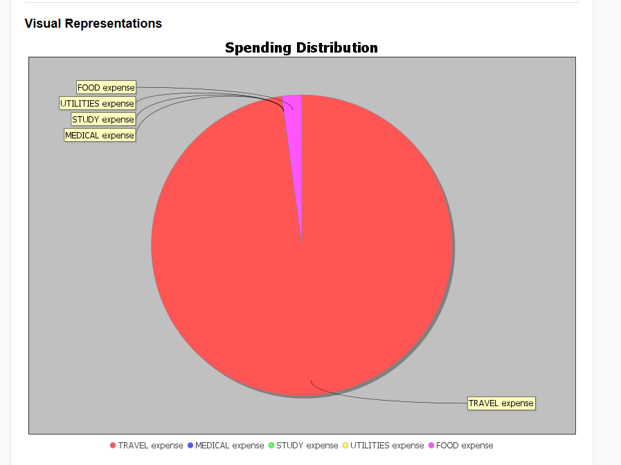
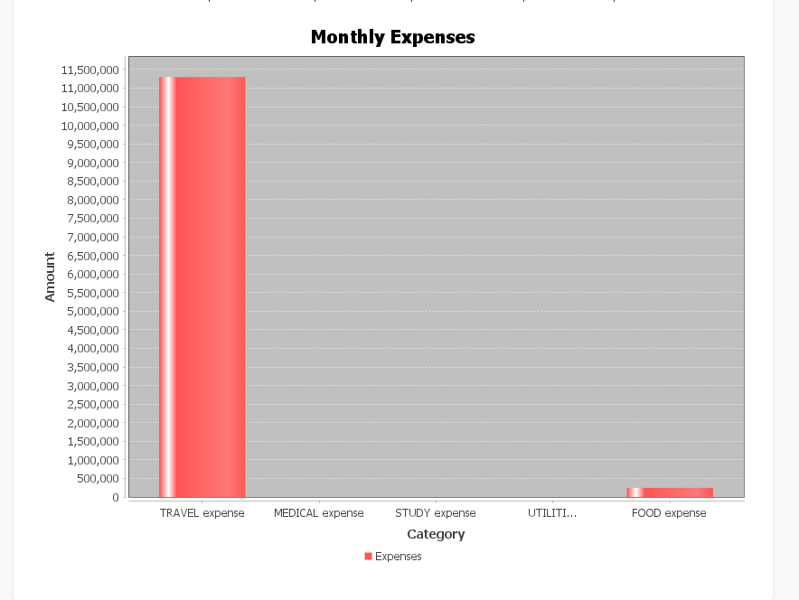
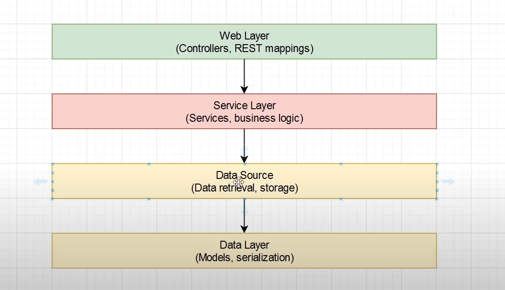

# Personal Finance Manager 💰

## Overview
Personal Finance Manager is a comprehensive platform for tracking financial transactions, managing expenses, and generating insightful financial reports.

## 🛠️ Setup
1. Clone the repository
2. Install Java 17+
3. Configure MongoDB
4. Run with Gradle or Docker


## 🔗 Important Links
* **Backend Deployment**: [Live API](https://syfe.uphargaur.tech/)
* **Backend Repositories**:
  * [Personal Finance Manager](https://github.com/uphargaur/Personal-Finance-Manager)
  * [Personal Finance Dashboard](https://github.com/uphargaur/Personal-Finance-Dashboard)
* **Frontend**: Coming Soon

## 🚀 Features

- **User Registration and Authentication:** Users can create an account and authenticate with email and password using JWT.
- **Transaction Management:** Users can add, update, view, and delete transactions categorized into different categories such as `Food`, `Travel`, `Rent`, and custom categories.
- **Custom Categories:** Users can add and manage custom categories for their transactions.
- **Pagination Support:** Transactions are fetched with pagination for improved performance.
- **Reports:** Generate detailed financial reports (monthly, yearly) showing income, expenses, and savings, along with visual representations like pie charts and bar graphs.


  


  
- **Category Management:** Users can add and manage categories for transactions dynamically.

## 💻 Technologies Used

- **Spring Boot:** A Java framework used to develop production-ready applications.
- **MongoDB:** A NoSQL database used to store and retrieve data.
- **Spring Security:** For implementing authentication and authorization (JWT-based).
- **Spring Data MongoDB:** For interacting with the MongoDB database.
- **JWT (JSON Web Token):** Used for stateless authentication and securing API endpoints.
- **BCrypt:** For securely hashing user passwords.

## Prerequisites

- Java 17 or above
- Spring Boot
- MongoDB
- A REST client (like Postman or Insomnia) to test API endpoints

## Installation

1. Clone the repository to your local machine:

```bash
git clone https://github.com/your-username/personal-finance-manager.git
cd personal-finance-manager
```

# Architecture Design


# API Endpoints

## Authentication Endpoints

### Register User
`POST /auth/register`

#### Request Body
```json
{
    "name": "John Doe", 
    "email": "johndoe@example.com", 
    "password": "password123"
}
```

#### Response
```json
{
    "message": "Registration successful"
}
```

### Login User
`POST /auth/login`

#### Request Body
```json
{
    "email": "johndoe@example.com", 
    "password": "password123"
}
```

#### Response
```json
{
    "token": "jwt-token"
}
```

## Transaction Endpoints

### Add Transaction
`POST /transactions/add`

#### Request Body
```json
{
    "amount": 500.0, 
    "date": "2025-01-24", 
    "category": "Food", 
    "description": "Groceries"
}
```

#### Response
```json
{
    "id": "uuid", 
    "userId": "userId", 
    "amount": 500.0, 
    "date": "2025-01-24", 
    "category": "Food", 
    "description": "Groceries"
}
```

### Fetch Transactions
`GET /transactions`

#### Request Parameters
`/page=1&size=10&type=Food`

#### Response
```json
{
    "pageNo": 1, 
    "pageSize": 10, 
    "totalPages": 5, 
    "totalTransactions": 50, 
    "transactions": [
        {
            "id": "uuid", 
            "userId": "userId", 
            "category": "Food", 
            "amount": 500.0, 
            "date": "2025-01-24", 
            "description": "Groceries"
        }
    ]
}
```

### Update Transaction
`PUT /transactions/{transactionId}`

#### Request Body
```json
{
    "amount": 600.0, 
    "date": "2025-02-01", 
    "category": "Food", 
    "description": "Updated Groceries"
}
```

#### Response
```json
{
    "id": "updated-uuid", 
    "userId": "userId", 
    "category": "Food", 
    "amount": 600.0, 
    "date": "2025-02-01", 
    "description": "Updated Groceries"
}
```

### Delete Transaction
`DELETE /transactions/{transactionId}`

#### Response
```json
{
    "message": "Transaction deleted successfully"
}
```

## Report Endpoints

### Monthly Report
`GET /reports/monthly`

#### Response
```json
{
    "month": "January", 
    "year": 2025, 
    "income": 1000, 
    "expenses": 500, 
    "savings": 500, 
    "visualRepresentation": "base64-image-data"
}
```

### Yearly Report
`GET /reports/yearly`

#### Response
```json
{
    "year": 2025, 
    "income": 12000, 
    "expenses": 6000, 
    "savings": 6000, 
    "visualRepresentation": "base64-image-data"
}
```

## Contributing
1. Fork repository
2. Create branch
3. Commit changes
4. Push to branch
5. Open pull request